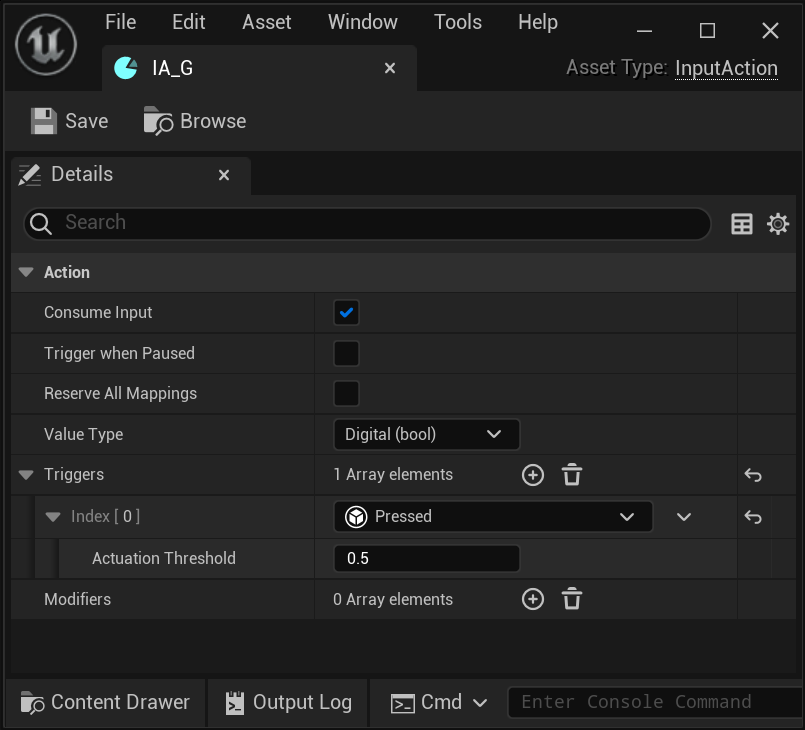
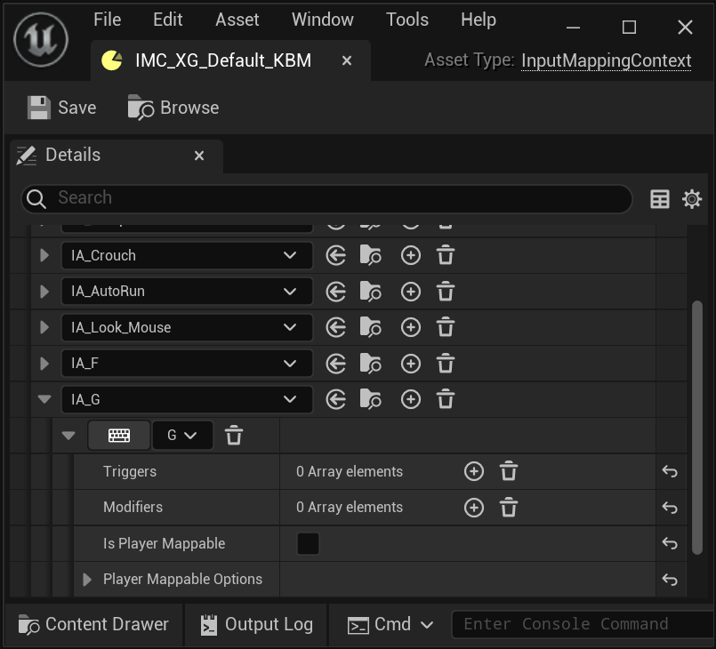
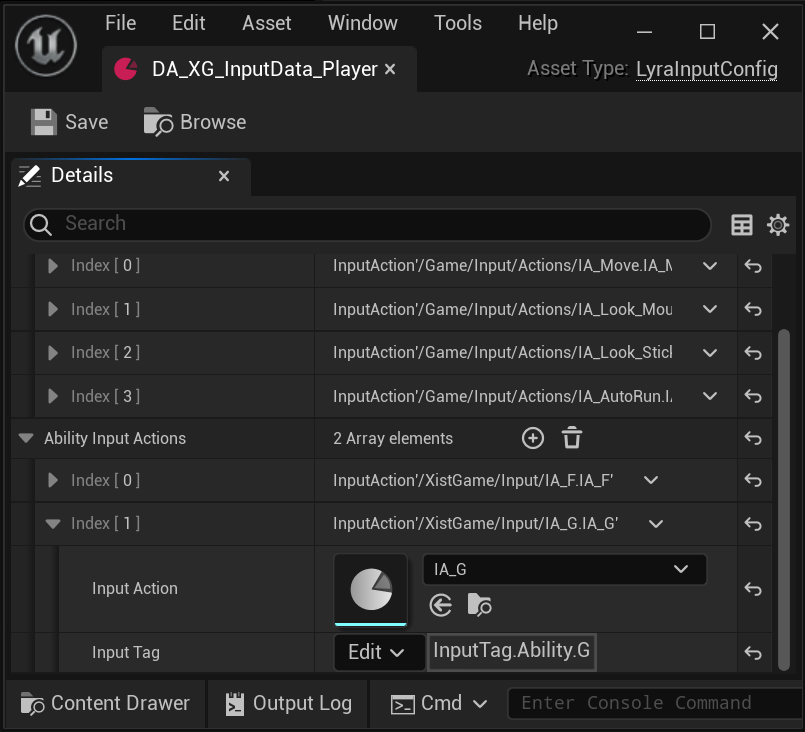
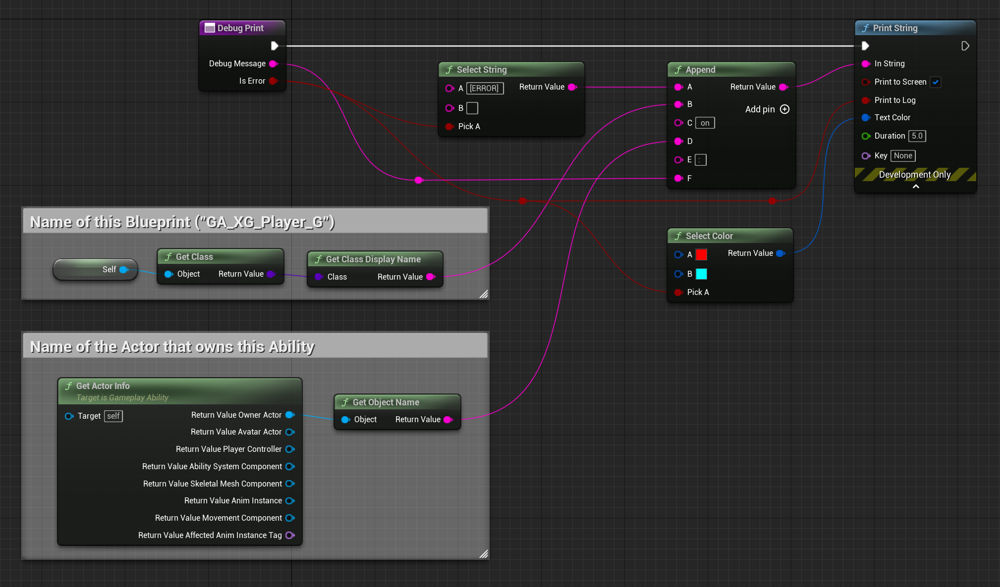
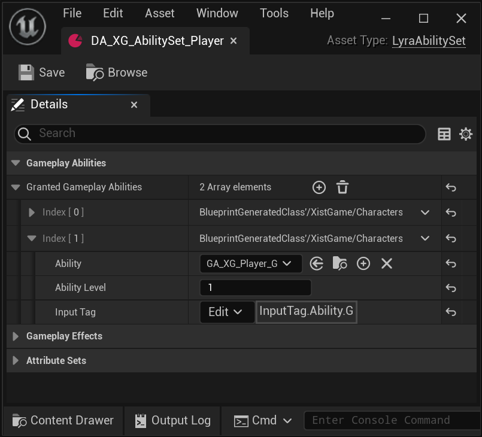
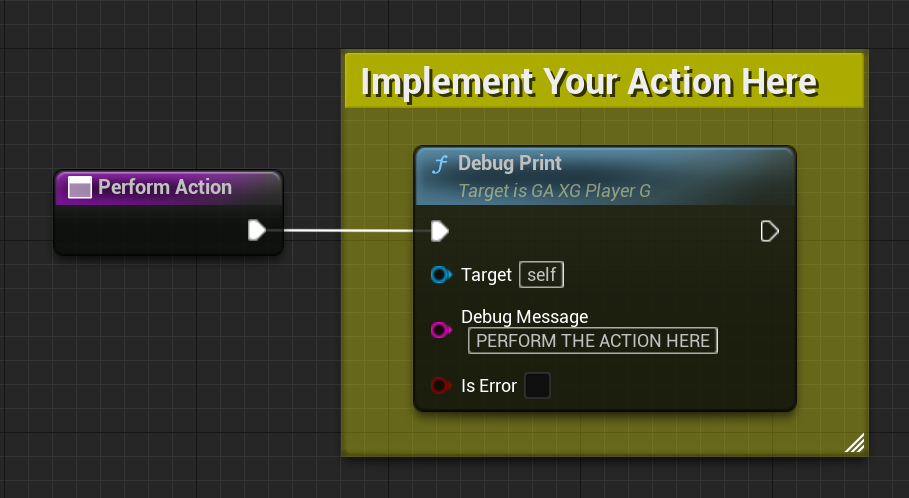

# How To: Create a New Gameplay Ability

For this tutorial we're going to make a new ability that executes whenever the player pushes the `G` key on their keyboard.

The naming convention here is not going to be great, because this ability is intended only for developer use.  For a real ability you'd want to name it something that actually represents what you intend to happen during this ability.

In this tutorial we will:

- Connect to Lyra's Enhanced Input system:
  - Create an Input Action
  - Associate it with a new Gameplay `InputTag`
  - Map the Input Action to the `G` key on the keyboard
  - Map the Input Action to the new `InputTag`
- Create a new Gameplay Ability:
  - Create the code to do whatever action you want
  - Add it to the player's Ability Set, associated with its `InputTag`

## 1. Create a New Input Action

Right click in content browser, `Input` > `Input Action`

Name it `IA_G`, configure it as in this screenshot:

## 2. Create new `InputTag.Ability.G` Gameplay Tag

Open Project Settings, click `Project` > `GameplayTags`.

In `Gameplay Tags` > `Gameplay Tag List`, add a new tag named `InputTag.Ability.G`

## 3. Add `IA_G` to your `InputMappingContext`

Open the `InputMappingContext` where you want the `G` ability to be active.  Mine is called `IMC_XG_Default_KBM`, it contains all of the default key binds I want to be active for my player.

Add `IA_G` to the list of `Mappings` > `Mappings`. Configure it as in this screenshot:

Tip: If you don't know where yours is, open your Experience data asset (whichever Experience is configured in your current map), and look in the `Gameplay` > `Action Sets`.  Open each action set and look for one with an `Add Input Mapping` action.  The input mapping config listed here is the one you want to modify.  (Keep this file open, it likely also defines an `Add Input Binds` action which you'll need in the next step.)

## 4. Add Input Action-to-Tag Mapping

Open the `LyraInputConfig` where you want to be able to use the `G` ability.  Mine is called `DA_XG_InputData_Player`.

Add a new `Ability Input Action` (**Ability**, not Native).  Set the Input Action = `IA_G` and set the Input Tag = `InputTag.Ability.G`

Tip: If you don't know which `LyraInputConfig` data asset to modify:
- Open your Map
- Open this Map's Experience definition
- Look in `Gameplay` > `Action Sets`
  - Open each action set and look for one with an `Add Input Binds` action.
    - The Input Config listed here is the one you'll want to modify.

## 5. Create new Lyra Gameplay Ability

Right click on content browser, `Blueprint Class`, in All Classes search for `LyraGameplayAbility`.  I named mine `GA_XG_Player_G`.

Here is the code:

Here is the `DebugPrint` function, which is not at all important to this demo other than to explain why the debug strings are formatted the way they are:

## 6. Add New Ability to the Player's Ability Set

Open the `LyraAbilitySet` for your player, mine is called `DA_XG_AbilitySet_Player`.

Add the ability we created, associate it with the Input Tag we created.

Configure it like this:

Tip: If you don't know which `LyraAbilitySet` data asset to modify:
- Open your Map
- Open this Map's Experience definition
- Open the Experience's Pawn Data asset
- It will be one of the data assets listed in `Abilities` > `Ability Sets`
  - Mine is called `DA_XG_AbilitySet_Player`

# Congratulations! You've Added a new Gameplay Ability

You've now added a new Gameplay Ability to Lyra, so when you're playing the game and you push the `G` key, this ability will be activated and will run the code you put in its `PerformAction` function.  Put whatever you want there!

In this simple example, my `PerformAction` just calls `DebugPrint`, but you can have yours do whatever you want it to do.

## YouTube Video Tutorial

If you have any issues, particularly finding where the appropriate data assets are that you should be editing, check out my YouTube video tutorial on this topic:

<todo>Link Video Here</todo>

