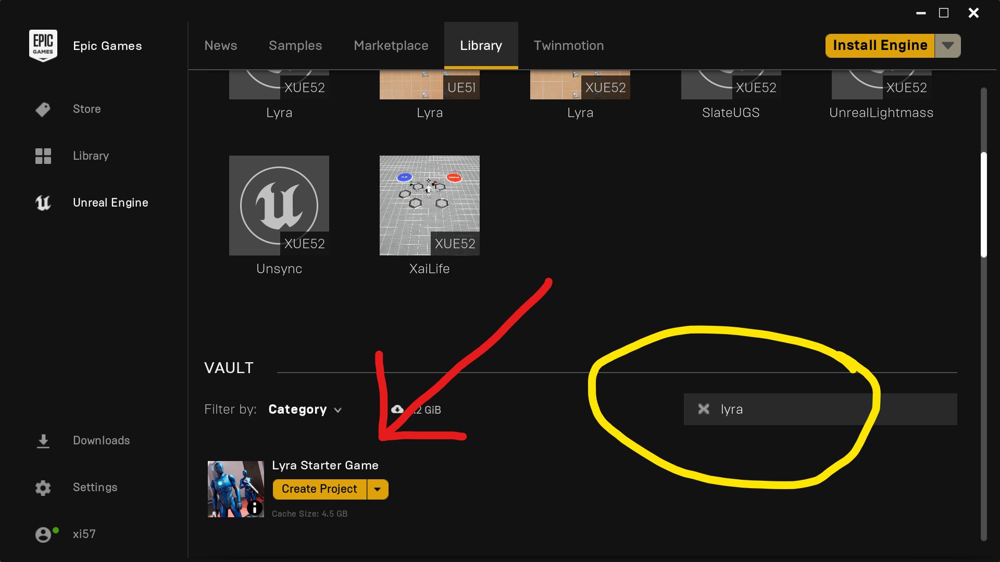
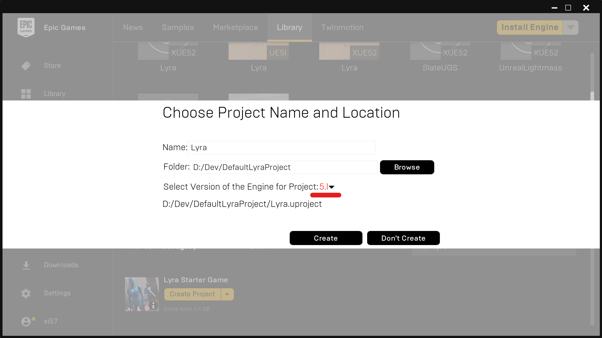

# How to Create a Lyra-based Project in Git

This details the procedure used to implement my [Git](/Git/)
branching strategy for a Lyra-based project.

How to choose the correct Engine/Lyra version for your project:

- To use Lyra `5.1`, checkout Engine branch `5.1`
- To use Lyra `5.2`, checkout Engine branch `5.2`
- Lyra is not on the `release` branch as of 5.1.1


## Procedure Overview

- [Create a `LyraStarterGame` project](#CreateContentProject) from Epic Games Launcher
- [Clone UnrealEngine](#CloneUnrealEngine) from GitHub
- [Initialize New Git Repo](#InitGitRepo)
- [Create `lyra-main` branch](#create-lyra-main)
  - Copy Source & Configs from GitHub
  - Copy Content from Epic Games Launcher
- [Create `lyra-xist` branch](#create-lyra-xist) based on `lyra-main`
- [Create `xist-game` branch](#create-xist-game) based on `lyra-xist`

## Summary of Result

- The `lyra-main` branch will be an exact mirror of Epic's source repository
  - with the latest Source/Configs from GitHub
  - with the latest Content from the Epic Games Launcher
- The `lyra-xist` branch will be our custom version of Lyra with upgrades.
- The `xist-game` branch will contain our Game code and content.

You will want to periodically
[Merge Epic Source into Git](./Procedure-Merge-Epic-Source-into-Git)
to get updates from Epic.


# Set up PowerShell variables

```powershell
# If you forked the engine to make your own custom engine,
# change this to be the URL to your fork
$EngineRepositoryUrl = "https://github.com/EpicGames/UnrealEngine"

# Which branch of the Engine and Lyra do we want to import?
$EngineBranch = "5.1"

# The directory where you keep your Game Code
$WorkspaceDir = "D:/Dev/XistGame"  # set this

# The directory where you want to clone UnrealEngine
$UE5Root = "E:/GitHub/UnrealEngine"  # set this
$LyraSourceDir = "$UE5Root/Samples/Games/Lyra"  # don't change this line

# This is the directory where we will save a new sample
# LyraStarterGame project from the Launcher.
$LyraContentDir = "D:/Dev/DefaultLyraProject"  # set this

$LyraMainBranch   = "lyra-main"
$LyraCustomBranch = "lyra-xist"  # "lyra-yourname"
$GameBranch       = "xist-game"
```


<a id='CreateContentProject'></a>
# Create a `LyraStarterGame` project from Launcher

Store the sample project in `$LyraContentDir`, for example `D:/Dev/DefaultLyraProject`

###### NOTE: CREATE A FRESH, BLANK SAMPLE GAME

DO NOT IMPORT A PROJECT DIRECTORY THAT YOU HAVE MADE CHANGES TO.

When in doubt, back up the previous game and make a new one here.

[](./screenshots/Launcher-Create-LyraStarterGame-Project.png)

I used these settings:

[](./screenshots/Launcher-Create-LyraStarterGame-Project-Settings.png)

Note what you use for the `Folder` here **MUST EQUAL** your `$LyraContentDir` value.   Set it accordingly.

You can name your project whatever you want.


<a id='CloneUnrealEngine'></a>
# Update UnrealEngine Source from GitHub

You either need to clone the Engine source (if you haven't already),
or update the source you previously cloned.

Here, we'll do both, just to be safe.


## Clone Unreal Engine from GitHub

NOTE: If you already cloned the Unreal Engine, you can skip this step.
You will need to make sure that your `$UE5Root` value matches the directory
where you cloned UE5.

```powershell
# cd to the PARENT of the $UE5Root directory.
# This directory must exist.  Create it if needed.
cd $UE5Root/..

# $UE5Root does not exist; clone $EngineRepositoryUrl into $UE5Root
git clone --branch $EngineBranch $EngineRepositoryUrl $UE5Root
```


## Update previously-cloned Unreal Engine Source

First, you want to make sure you're on the correct branch,
and then pull from Epic.

```powershell
# If you already cloned the Engine, $UERoot already exists
cd $UE5Root

# Switch branches if $EngineBranch is not the current branch
$isCorrectBranch = $EngineBranch -ieq (git branch)
if (!$isCorrectBranch)
{
  git fetch origin
  git checkout $EngineBranch
}

# pull latest from origin
git pull origin
```

[Continue to Initialize Project Git Repo](#InitGitRepo), you do not need to clone again.

<a id='InitGitRepo'></a>
# Initialize Project Git Repo

Before you do this part, prepare the files you will use for `.gitignore` and `.gitattributes`.

See [Xist's UE5 Git Init](https://github.com/XistGG/UE5-Git-Init)
for some reasonable defaults.

```powershell
# make dir $WorkspaceDir if needed
if (!(Test-Path $WorkspaceDir)) {mkdir $WorkspaceDir}

cd $WorkspaceDir

git init
git add .gitignore .gitattributes  # YOU MUST PROVIDE THESE FILES
git commit -m "Initialize Git"
```


<a id='create-lyra-main'></a>
# Create `lyra-main` branch

```powershell
cd $WorkspaceDir

# Create lyra-main branch
git branch $LyraMainBranch
```

## Copy Source from Epic to `lyra-main` branch

```powershell
cd $WorkspaceDir

# Checkout lyra-main
git checkout $LyraMainBranch

# Example: Recursive Copy E:/GitHub/UnrealEngine/Samples/Games/Lyra/* into Workspace dir
Copy-Item -Force -Recurse $LyraSourceDir/* $WorkspaceDir

git add --all
git commit -m "Initial Import of Lyra from Epic"
```

### Copy Content from Lyra Sample into `lyra-main` branch

```powershell
# This function copies a specific Content folder from the Sample project into our Workspace
function CopyLyraContentFolder()
{
  param( [Parameter()] $ContentFolder,
         [Parameter()] $DirPrefix    )
  # Remove the leading $ContentFolder from the name
  $RelativeContentFolder = $ContentFolder.FullName.substring($DirPrefix.length)
  # Add leading $WorkspaceDir folder to the name
  $WorkspaceContentFolder = "$WorkspaceDir/$RelativeContentFolder"
  # Create the directory if it does not exist
  if (!(Test-Path $WorkspaceContentFolder)) {mkdir $WorkspaceContentFolder}
  $WorkspaceContentFolder = Get-Item $WorkspaceContentFolder
  # Recursively copy Content into our Workspace, overwriting the Workspace as needed
  Write-Host "COPY: $($ContentFolder.FullName) => $($WorkspaceContentFolder.FullName)"
  Copy-Item -Force -Recurse "$($ContentFolder.FullName)/*" $WorkspaceContentFolder
}

# Get a list of all 'Content' folders in the sample dir

$LyraContentFolders = Get-ChildItem $LyraContentDir -Recurse -Directory `
    | Where-Object {$_.Name -ieq 'Content'}

Write-Host "The Lyra Content Folders are:"
$LyraContentFolders | %{$_.FullName}

# Copy all the 'Content' folders into the $WorkspaceDir

$DirPrefix = (Get-Item $LyraContentDir).FullName
foreach ($ContentFolder in $LyraContentFolders)
{
  $NewFolder =& CopyLyraContentFolder $ContentFolder -DirPrefix:$DirPrefix
}

cd $WorkspaceDir

git add --all  # This might take a while...
git commit -m "Initial Import of Lyra Launcher Content"
```


<a id='create-lyra-xist'></a>
# Create `lyra-xist` branch based on `lyra-main`

```powershell
cd $WorkspaceDir

git checkout $LyraMainBranch    # Start on lyra-main
git branch $LyraCustomBranch    # Create lyra-xist
git checkout $LyraCustomBranch  # Checkout lyra-xist
```

- Make any `LYRAGAME_API` edits to this branch
- Add any shared Plugins to this branch and integrate them with Lyra
- This is your shared-between-games custom Lyra


<a id='create-xist-game'></a>
# Create `xist-game` branch based on `lyra-xist`

```powershell
cd $WorkspaceDir

git checkout $LyraCustomBranch  # Start on lyra-xist
git branch $GameBranch          # Create xist-game
git checkout $GameBranch        # Checkout xist-game
```

- This is the branch where your Game Feature Plugin goes
  - Any/all content and configs that are game-specific go here

### Make your game!

- Associate your new `.uproject` with your custom Engine
- Generate Project Files
- `rider Lyra.uproject` *(whatever you called your project)*


# Clean up as Desired

You no longer need the `$LyraContentDir` (`D:/Dev/DefaultLyraProject`),
as we copied all the interesting parts from it into our Git repo.
You can delete this directory and all its contents if you like.


# Periodically: Merge Updates from Epic

You will want to periodically merge upstream source updates from Epic
into your Project.

The procedure for doing so is similar to what we just did, but it
updates an existing repository rather than creating a new one.

[Procedure: Merge Epic Source into Git](./Procedure-Merge-Epic-Source-into-Git)

For more details see the dedicated docs for the procedure, above.
